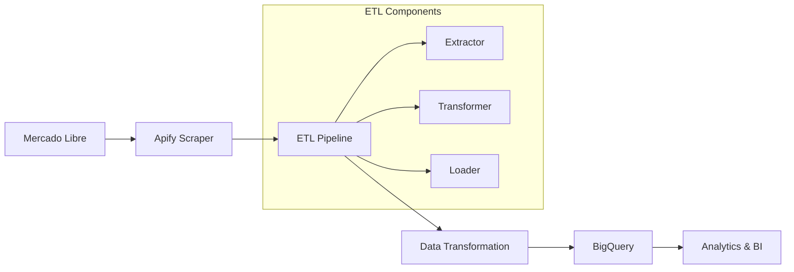

# 🛒 Pipeline ETL Mercado Libre - Samsung Galaxy S25

Um pipeline ETL robusto e escalável que extrai dados de produtos Samsung Galaxy S25 do Mercado Libre Argentina usando Apify, processa os dados e os carrega no Google BigQuery para análise.

## 🏗️ Arquitetura



## ✨ Funcionalidades

- 🔄 **Extração automatizada** via Apify Actor personalizado
- 🧹 **Transformação inteligente** de dados com validação
- 📊 **Carga otimizada** no BigQuery com particionamento
- 📝 **Logs estruturados** e monitoramento completo
- 🐳 **Containerização** com Docker para deploy fácil
- ⚙️ **Configuração flexível** via YAML e variáveis de ambiente
- 🔄 **Retry automático** com backoff exponencial
- 🚨 **Tratamento robusto** de erros e exceções

## 📋 Pré-requisitos

### Ambiente de Desenvolvimento

- 🐍 **Python 3.11+** 
- 🐳 **Docker** (opcional, para containerização)
- 📦 **Git** para versionamento

### Serviços Cloud

- ☁️ **Google Cloud Platform** (conta ativa)
- 📊 **BigQuery** (habilitado no projeto GCP)
- 🔑 **Service Account** com as seguintes permissões:
  - `bigquery.dataEditor`
  - `bigquery.jobUser`
  - `bigquery.user`

### APIs Externos

- 🕷️ **Conta Apify** com token de API
- 🛒 **Acesso à API do Mercado Libre** (público)

## � Instalação e Configuração

### 1️⃣ Clone o repositório

```bash
git clone https://github.com/lucasedmundo11/Meli-ETL.git
cd Meli-ETL
```

### 2️⃣ Configure o ambiente Python

```bash
# Criar ambiente virtual (recomendado)
python -m venv env
source env/bin/activate  # Linux/Mac
# ou
# env\Scripts\activate  # Windows

# Instalar dependências
pip install -r requirements.txt
```

### 3️⃣ Configure as variáveis de ambiente

Crie um arquivo `.env` na raiz do projeto:

```bash
# Google Cloud Platform
GOOGLE_APPLICATION_CREDENTIALS="path/to/service-account.json"
GCP_PROJECT_ID="meli-etl-476805"
BQ_DATASET_ID="mercado_libre"
BQ_TABLE_ID="products_samsung_s25"

# Apify
APIFY_TOKEN="seu_token_apify_aqui"

# Configurações do Pipeline
LOG_LEVEL="INFO"
```

### 4️⃣ Configure o BigQuery

```bash
# Criar dataset (se não existir)
bq mk --dataset --location=US ${GCP_PROJECT_ID}:mercado_libre

# Criar tabela usando o schema fornecido
bq mk --table \
  ${GCP_PROJECT_ID}:mercado_libre.products_samsung_s25 \
  config/bigquery_schema.sql
```

### 5️⃣ Execute o pipeline

```bash
python src/main.py
```

## 🐳 Execução com Docker

### Build da imagem

```bash
docker build -t meli-etl-pipeline .
```

### Execução com Docker Compose (Recomendado)

```yaml
# docker-compose.yml
version: '3.8'
services:
  meli-etl:
    build: .
    environment:
      - GCP_PROJECT_ID=meli-etl-476805
      - BQ_DATASET_ID=mercado_libre
      - BQ_TABLE_ID=products_samsung_s25
      - APIFY_TOKEN=${APIFY_TOKEN}
      - LOG_LEVEL=INFO
    volumes:
      - ./config/service-account.json:/app/config/service-account.json:ro
      - ./logs:/app/logs
```

```bash
docker-compose up --build
```

### Execução Docker standalone

```bash
docker run --rm \
  -e GCP_PROJECT_ID="meli-etl-476805" \
  -e BQ_DATASET_ID="mercado_libre" \
  -e BQ_TABLE_ID="products_samsung_s25" \
  -e APIFY_TOKEN="seu_token_apify" \
  -v $(pwd)/config/service-account.json:/app/config/service-account.json:ro \
  -v $(pwd)/logs:/app/logs \
  meli-etl-pipeline
```

## 📊 Schema de Dados

A tabela do BigQuery utiliza o seguinte schema otimizado com **particionamento por data** e **clustering** para melhor performance:

| Campo | Tipo | Descrição | Constraints |
|-------|------|-----------|-------------|
| `product_id` | STRING | ID único do produto no MeLi | NOT NULL |
| `title` | STRING | Título completo do produto | - |
| `subtitle` | STRING | Subtítulo/descrição breve | - |
| `originalPrice` | STRING | Preço original (formato string) | - |
| `price` | FLOAT64 | Preço numérico processado | - |
| `price_string` | STRING | Preço formatado como string | - |
| `alternativePrice` | STRING | Preço alternativo/promocional | - |
| `rating` | FLOAT64 | Avaliação média (0-5) | - |
| `reviews` | INT64 | Número de avaliações | - |
| `condition` | STRING | Condição (new, used, refurbished) | - |
| `seller` | STRING | Nome/ID do vendedor | - |
| `description` | STRING | Descrição detalhada do produto | - |
| `images` | ARRAY<STRING> | URLs das imagens do produto | - |
| `sellCount` | INT64 | Quantidade vendida | - |
| `url` | STRING | URL do produto no MeLi | - |
| `currency` | STRING | Moeda (ARS, USD, etc.) | - |
| `extraction_date` | TIMESTAMP | Data/hora da extração | NOT NULL |
| `JOB_RUN` | TIMESTAMP | ID da execução do job | NOT NULL |

### Otimizações da Tabela

- **Particionamento**: Por `DATE(JOB_RUN)` para queries temporais eficientes
- **Clustering**: Por `seller`, `condition`, `currency` para melhor performance
- **Localização**: US (para compatibilidade global)

## 📈 Consultas de Exemplo

### 💰 Análise de Preços por Condição

```sql
SELECT 
  condition,
  COUNT(*) as product_count,
  AVG(price) as avg_price,
  MIN(price) as min_price,
  MAX(price) as max_price,
  STDDEV(price) as price_std
FROM `meli-etl-476805.mercado_libre.products_samsung_s25`
WHERE price IS NOT NULL
GROUP BY condition
ORDER BY avg_price DESC;
```

### 🏆 Top Vendedores por Volume

```sql
SELECT 
  seller,
  COUNT(*) as product_count,
  AVG(price) as avg_price,
  AVG(rating) as avg_rating,
  SUM(reviews) as total_reviews
FROM `meli-etl-476805.mercado_libre.products_samsung_s25`
WHERE seller IS NOT NULL
GROUP BY seller
HAVING COUNT(*) >= 5  -- Apenas vendedores com 5+ produtos
ORDER BY product_count DESC
LIMIT 10;
```

### 📊 Evolução Temporal dos Preços

```sql
SELECT 
  DATE(extraction_date) as extraction_date,
  COUNT(*) as products_extracted,
  AVG(price) as avg_price,
  COUNT(DISTINCT seller) as unique_sellers
FROM `meli-etl-476805.mercado_libre.products_samsung_s25`
WHERE price IS NOT NULL
GROUP BY DATE(extraction_date)
ORDER BY extraction_date DESC;
```

### 🔍 Produtos com Melhor Avaliação

```sql
SELECT 
  title,
  price,
  rating,
  reviews,
  seller,
  condition,
  url
FROM `meli-etl-476805.mercado_libre.products_samsung_s25`
WHERE rating >= 4.5 
  AND reviews >= 10
  AND price IS NOT NULL
ORDER BY rating DESC, reviews DESC
LIMIT 20;
```

## 🔧 Desenvolvimento Local

### Estrutura do Projeto

```text
Meli-ETL/
├── 📁 src/                     # Código fonte principal
│   ├── 📁 extractors/          # Módulos de extração de dados
│   │   ├── apify_extractor.py  # Extrator usando Apify
│   │   └── meli_extractor.py   # Extrator direto da API MeLi
│   ├── 📁 transformers/        # Módulos de transformação
│   │   └── product_transformer.py
│   ├── 📁 loaders/            # Módulos de carga
│   │   └── bigquery_loader.py
│   └── main.py                # Pipeline principal
├── 📁 config/                 # Configurações
│   ├── config.yaml           # Configurações do projeto
│   └── bigquery_schema.sql   # Schema da tabela BigQuery
├── 📁 notebooks/             # Jupyter notebooks para análise
│   ├── Final_Solution.ipynb  # Solução completa
│   └── test_api.ipynb       # Testes da API
├── 📁 scripts/               # Scripts de deploy
│   └── deploy.sh            # Script de deployment
├── requirements.txt          # Dependências Python
├── Dockerfile               # Container Docker
└── README.md               # Esta documentação
```

### Ambiente de Desenvolvimento

```bash
# Instalar ferramentas de desenvolvimento
pip install black flake8 pytest pytest-cov mypy

# Formatação automática do código
black src/ --line-length 88

# Verificação de estilo
flake8 src/ --max-line-length=88 --ignore=E203,W503

# Verificação de tipos
mypy src/ --ignore-missing-imports

# Executar testes (quando disponíveis)
pytest tests/ -v --cov=src/ --cov-report=html
```

### 📝 Sistema de Logs

Os logs são estruturados e salvos em múltiplos destinos:

- **Console**: Logs em tempo real durante execução
- **Arquivo**: `etl_pipeline.log` com histórico completo
- **Formato**: JSON estruturado com metadados

**Informações logadas:**
- ⏰ Timestamps de cada etapa
- 📊 Métricas de performance detalhadas
- ❌ Erros e exceções com stack trace
- 📈 Contadores de registros processados
- 🔄 Status de retry e recuperação

### 🚨 Monitoramento e Métricas

**Métricas coletadas automaticamente:**
- 📥 **Produtos extraídos**: Total de itens obtidos do Apify
- 🔄 **Produtos transformados**: Registros processados com sucesso
- 📤 **Produtos carregados**: Registros inseridos no BigQuery
- ⏱️ **Tempo de execução**: Duration total e por etapa
- ✅ **Taxa de sucesso**: Percentual de conclusão
- 💾 **Uso de memória**: Monitoramento de recursos

### 🔐 Segurança e Boas Práticas

- 🔑 **Service Account** com permissões mínimas necessárias
- 🚫 **Credenciais nunca commitadas** no código
- 🔒 **Logs sem informações sensíveis** (tokens, IDs mascarados)
- ✅ **Validação rigorosa** de entrada de dados
- 🛡️ **Rate limiting** para APIs externas
- 🔄 **Retry exponencial** com jitter para resiliência

## ⚠️ Troubleshooting

### 🔐 Erro de Autenticação GCP

```bash
# Verificar credenciais atuais
gcloud auth list

# Autenticar novamente
gcloud auth application-default login

# Verificar projeto ativo
gcloud config get-value project
```

### 📊 Problemas com BigQuery

**Erro de quota:**

- Verificar limites no [GCP Console](https://console.cloud.google.com/iam-admin/quotas)
- Implementar retry com backoff exponencial
- Considerar processar em lotes menores

**Problemas de schema:**

```bash
# Verificar schema atual
bq show --schema meli-etl-476805:mercado_libre.products_samsung_s25

# Recriar tabela se necessário
bq rm -t meli-etl-476805:mercado_libre.products_samsung_s25
bq mk --table meli-etl-476805:mercado_libre.products_samsung_s25 config/bigquery_schema.sql
```

### 🕷️ Problemas com Apify

**Timeout ou falhas:**

- Verificar saldo da conta Apify
- Ajustar configurações de proxy
- Reduzir `maxItemCount` na configuração

## 🤝 Como Contribuir

1. 🍴 **Fork** este repositório
2. 🌟 **Crie uma branch** para sua feature:

   ```bash
   git checkout -b feature/minha-nova-feature
   ```

3. ✨ **Faça suas alterações** seguindo os padrões do projeto
4. ✅ **Teste suas alterações**:

   ```bash
   black src/ && flake8 src/ && pytest
   ```

5. 📝 **Commit suas mudanças**:

   ```bash
   git commit -m "feat: adiciona nova funcionalidade X"
   ```

6. 🚀 **Push para sua branch**:

   ```bash
   git push origin feature/minha-nova-feature
   ```

7. 🔄 **Abra um Pull Request**

### Padrões de Commit

Usamos [Conventional Commits](https://www.conventionalcommits.org/):

- `feat:` nova funcionalidade
- `fix:` correção de bug
- `docs:` mudanças na documentação
- `style:` formatação, ponto e vírgula, etc
- `refactor:` mudanças de código que não adicionam features nem corrigem bugs
- `test:` adicionando testes
- `chore:` atualizações de build, configs, etc

## 📄 Licença

Este projeto está licenciado sob a **MIT License** - veja o arquivo [LICENSE](LICENSE) para detalhes.

## 👨‍� Autor

**Lucas Edmundo**  
📧 Email: [lucas.edmundo@exemplo.com](mailto:lucas.edmundo@exemplo.com)  
🐙 GitHub: [@lucasedmundo11](https://github.com/lucasedmundo11)  
💼 LinkedIn: [Lucas Edmundo](https://linkedin.com/in/lucas-edmundo)

## 📚 Referências e Recursos

- 🛒 [Documentação API Mercado Libre](https://developers.mercadolibre.com/)
- 🕷️ [Apify Platform Documentation](https://docs.apify.com/)
- ☁️ [Google Cloud BigQuery](https://cloud.google.com/bigquery/docs)
- 🐳 [Docker Best Practices](https://docs.docker.com/develop/best-practices/)
- 🐍 [Python ETL Patterns](https://docs.python.org/3/library/logging.html)

---

⭐ **Se este projeto foi útil para você, considere dar uma estrela!** ⭐